# Developer Guide

This guide explains how BudgetBot is designed, specified, implemented, tested, documented, and released.

The complete documentation set is:

- `README.md`: project landing page, quick start, commands, layout, and delivery summary;
- `docs/UserGuide.md`: end-user behaviour and peer-testing procedures;
- `docs/DeveloperGuide.md`: this design and engineering record;
- `CONTRIBUTING.md`: contribution workflow and Conventional Commits; and
- `openspec/`: source-controlled proposals, designs, specifications, and task records.

## Development prerequisites

| Task                              | Required tooling                                                                            |
|-----------------------------------|---------------------------------------------------------------------------------------------|
| Build or run the Java application | JDK 25                                                                                      |
| Run the documentation site        | Node.js 24 or later                                                                         |
| Build native installers           | A full JDK 25 containing `jpackage`; Windows MSI packaging also needs WiX Toolset on `PATH` |

The Gradle Wrapper is checked into the repository. Use `.\gradlew.bat` on Windows and `./gradlew` on macOS/Linux; a system Gradle installation is not required.


## Getting Started

### Running BudgetBot from source

From the repository root:

```text
# Windows PowerShell
.\gradlew.bat run

# macOS/Linux
./gradlew run
```

The application creates its parent data directory and initializes the SQLite schema on first start. The initial database contains the default settings and categories but no transactions or user-created budgets. The first screen is the Dashboard for the current calendar month.

### Useful build and quality commands

Run these commands from the repository root. The Windows examples use the checked-in batch wrapper; replace it with `./gradlew` on macOS/Linux.

```text
.\gradlew.bat test                  # Run the JUnit and TestFX test suite
.\gradlew.bat check                 # Run tests, architecture and Java quality gates, and coverage verification
.\gradlew.bat spotlessApply         # Format Java sources with Google Java Format
.\gradlew.bat spotbugsMain          # Run SpotBugs with FindSecBugs on production code
.\gradlew.bat jacocoTestReport      # Generate HTML and XML coverage reports
.\gradlew.bat openJacocoReport      # Generate and open the HTML coverage report
.\gradlew.bat javadoc               # Generate API documentation
.\gradlew.bat openJavadoc           # Generate and open API documentation
```

The configured JaCoCo gate requires at least 80% instruction coverage for the bundle. Reports are written below `build/reports/`; Javadoc is written below `build/docs/javadoc/`. CI also generates a package-and-total JaCoCo Markdown table with `scripts/summarize_jacoco.py` and uploads the quality reports as an artifact.

### Preparing clean or demo data

The database launchers are intended for testing, demonstrations, and database-related development. Close BudgetBot first. Reset is destructive: it permanently deletes only the selected database and matching SQLite sidecar files, then recreates the normal first-start schema, default settings, and default categories. Seed adds one deterministic current-month scenario and refuses to append a second scenario to a database that already contains transactions.

**Windows PowerShell**

```powershell
.\scripts\reset-database.ps1  # Type RESET when prompted.
.\scripts\seed-demo-data.ps1
```

**macOS/Linux**

```sh
sh scripts/reset-database.sh  # Type RESET when prompted.
sh scripts/seed-demo-data.sh
```

The seed data is described in full in the [Developer Database Tooling](#developer-database-tooling) section.

### Running the documentation site

The Docusaurus site is in `website/` and publishes the root README at `/`, the Developer Guide at `/DeveloperGuide`, and the User Guide at `/UserGuide`.

```powershell
cd website
npm ci
npm start
```

Use `npm run build` to perform a production documentation build. The CI workflow runs this build with Node.js 24.

## Product definition

### Goal

BudgetBot provides a small local workspace for one user to record cash flow and monitor monthly category limits. It is intentionally understandable without a server or account:

```text
income and expenses -> monthly cash-flow view
expenses + categories + monthly base amounts -> budget-status view
```

### Current capabilities

| Capability            | Implemented behaviour                                                                                                                                               |
|-----------------------|---------------------------------------------------------------------------------------------------------------------------------------------------------------------|
| Local workspace       | JavaFX desktop window, one local user, SQLite data at `~/.budgetbot/budgetbot.db`, no account or network service.                                                   |
| Navigation            | Dashboard, Transactions, Budgets, and Settings views; the selected month is shared by the first three views.                                                        |
| Transactions          | Add, edit, delete, and display dated income/expense entries. Income has no category; expenses require one.                                                          |
| Transaction discovery | Case-insensitive description substring search plus inclusive date, category, type, minimum-amount, and maximum-amount filters. Criteria combine with AND semantics. |
| Categories            | Nine default expense categories; add, rename, and remove with required reassignment. At least one category remains.                                                 |
| Budgets               | Per-category monthly base amounts and historical monthly snapshots. Available equals base amount, with no rollover or carryover.                                    |
| Dashboard             | Selected-month net cash flow, category Available/Spent/Remaining values, and semantic normal/warning/over-budget colours.                                           |
| Settings              | Global warning threshold from 1% through 99%, default 80%; copied into a monthly snapshot when that month is first created.                                         |
| Developer tooling     | Cross-platform reset and deterministic seed launchers using one Java database tool through the Gradle Wrapper.                                                      |
| Delivery              | Docusaurus documentation, GitHub Pages deployment, Java quality gates, coverage reports, and Windows/macOS/Linux native packaging.                                  |

### Non-goals

The current product does not provide accounts, authentication, multi-user access, cloud synchronization, bank/card connections, import/export, an HTTP API, all-time account balance, dashboard Recent activity, rollover/carryover, in-app backup/restore, or operating-system notifications.

## Technology stack and dependencies

The versions below are declared in `build.gradle`, `gradle/wrapper/gradle-wrapper.properties`, `website/package.json`, and the lockfile.

| Concern               | Technology                        | Declared version or configuration                                                                                                                                                          |
|-----------------------|-----------------------------------|--------------------------------------------------------------------------------------------------------------------------------------------------------------------------------------------|
| Language/runtime      | Java toolchain                    | Java 25                                                                                                                                                                                    |
| Build                 | Gradle Wrapper                    | Gradle 9.7.0; use `.\gradlew.bat` on Windows and `./gradlew` on macOS/Linux                                                                                                                |
| Desktop UI            | JavaFX Controls                   | JavaFX 25.0.1                                                                                                                                                                              |
| Database driver       | Xerial SQLite JDBC                | `org.xerial:sqlite-jdbc:3.53.2.1`                                                                                                                                                          |
| Unit framework        | JUnit Jupiter                     | `6.1.3`, executed through the JUnit Platform                                                                                                                                               |
| UI test framework     | TestFX JUnit 5 integration        | `4.0.18`                                                                                                                                                                                   |
| Test libraries        | Mockito JUnit Jupiter, Hamcrest   | `5.23.0` and `3.0`                                                                                                                                                                         |
| Architecture testing  | ArchUnit JUnit 5                  | `1.4.2`                                                                                                                                                                                    |
| Formatting            | Spotless and Google Java Format   | Spotless `8.10.0`                                                                                                                                                                          |
| Style analysis        | Checkstyle                        | `12.1.0`, rules in `config/checkstyle/checkstyle.xml`                                                                                                                                      |
| Code analysis         | PMD                               | `7.25.0`, production rules in `config/pmd/ruleset.xml`                                                                                                                                     |
| Bug/security analysis | SpotBugs with FindSecBugs         | SpotBugs plugin `6.5.6`, engine `4.10.3`, FindSecBugs `1.14.0`                                                                                                                             |
| Coverage              | JaCoCo                            | `0.8.14`; bundle instruction threshold is 80%                                                                                                                                              |
| Documentation         | Docusaurus and Mermaid            | Docusaurus `3.10.2`, `@docusaurus/theme-mermaid` `3.10.2`, Mermaid `11.17.2`, and Node.js `>=24.0`; `@mermaid-js/layout-elk` `0.1.9` is installed explicitly for the theme's client bundle |
| Automation            | GitHub Actions, Pages, Dependabot | workflows in `.github/workflows/`, weekly dependency updates in `.github/dependabot.yml`                                                                                                   |

## User stories

The following user stories use the Connextra sentence pattern `As a ..., I want ..., so that ...`. Read each row from left to right as one complete story.

| As a ...                 | I want to ...                                                                 | So that I can...                                                                |
|--------------------------|-------------------------------------------------------------------------------|---------------------------------------------------------------------------------|
| privacy-conscious user   | have my budget data stored locally                                            | use BudgetBot without an account or external financial service                  |
| budget user              | move between calendar months and see that month's income minus expenses       | have the dashboard describe the period I am reviewing                           |
| budget user              | record categorized expenses and uncategorized income                          | have cash flow and category spending calculated separately                      |
| budget user              | set a monthly base amount for each expense category                           | compare spending with an explicit limit                                         |
| budget user              | add, rename, and remove categories with reassignment                          | ensure historical expenses never lose their category reference accidentally     |
| budget user              | search and combine transaction filters                                        | find relevant entries without changing the saved data                           |
| budget user              | choose a warning percentage                                                   | have new monthly budget snapshots reflect my preferred alert boundary           |

## Product specifications

The product specifications use Gherkin keywords.

### Local application and persistence

```gherkin
Feature: Local persisted budget workspace

  Scenario: First startup creates a usable local workspace
    Given no BudgetBot database exists at the default per-user path
    When the user starts BudgetBot
    Then BudgetBot creates and initializes the SQLite database
    And the database contains the nine default expense categories
    And the warning threshold is 80 percent
    And no account or network connection is required

  Scenario: Reopening the application preserves saved data
    Given the user has saved categories, settings, budgets, and transactions
    When the user closes and starts BudgetBot again
    Then the saved data is loaded from the local database
    And the default categories are not duplicated
```

### Transactions

```gherkin
Feature: Income and expense transactions

  Scenario: Save income
    Given the user enters a positive amount and date
    And the transaction type is INCOME
    When the user saves the transaction
    Then the transaction has no category
    And its amount is added to net cash flow for its calendar month
    And it does not increase category spending

  Scenario: Save an expense
    Given the user enters a positive amount and date
    And the transaction type is EXPENSE
    And the user selects an expense category
    When the user saves the transaction
    Then its amount is subtracted from net cash flow for its calendar month
    And its amount increases spending for its category in that month

  Scenario: Reject an incomplete transaction
    Given the Add transaction dialog is open
    When the user saves without a valid amount, date, or required expense category
    Then the dialog stays open
    And validation feedback remains visible
    And no invalid transaction is stored

  Scenario: Edit and delete a transaction
    Given a saved transaction is visible in the Transactions table
    When the user edits and saves it
    Then the same transaction identifier contains the replacement values
    When the user selects Delete and confirms with OK
    Then the transaction is removed
```

### Transaction search and filtering

```gherkin
Feature: Search and filter transaction history

  Scenario: Apply combined criteria
    Given the user enters a description search, type, category, date range, minimum amount, and maximum amount
    When the user selects Apply filters
    Then only transactions satisfying every active criterion are displayed
    And description matching is a case-insensitive substring match
    And date and amount bounds are inclusive
    And results remain newest first
    And Edit and Delete actions remain available

  Scenario: Use the selected month as the default range
    Given both explicit date controls are empty
    When the user applies a description, type, category, or amount filter
    Then results are restricted to the selected calendar month

  Scenario: Search history with one explicit date bound
    Given the user enters only a start date or only an end date
    When the user selects Apply filters
    Then the supplied bound is inclusive
    And the other side of the date range is unbounded
    And results are not implicitly restricted to the selected month

  Scenario: Coordinate type and category controls
    Given the transaction filter panel is visible
    When the user selects Income
    Then the selected expense category is cleared
    And the Expense category control is hidden from the layout
    When the user selects an expense category
    Then the type becomes Expense
    And the category control remains visible

  Scenario: Reject an invalid filter range without losing results
    Given a transaction result set is displayed
    When the user applies a start date after the end date or a minimum amount greater than the maximum
    Then inline validation feedback is shown
    And the previous result set remains displayed

  Scenario: Clear filters
    Given search or filter criteria have been applied
    When the user selects Clear filters
    Then every criterion is removed
    And all transactions in the selected month are displayed
    And the result count describes the restored set

  Scenario: Show no matches
    Given the user applies valid criteria that match no transaction
    Then the result count is 0 transactions
    And the table displays No matching transactions.
```

### Categories and fixed monthly budgets

```gherkin
Feature: Categories and monthly budgets

  Scenario: Initialize default categories
    Given a new BudgetBot database is opened
    Then the categories include Housing & Utilities, Groceries, Dining, Transport, Health, Entertainment, Shopping, Education, and Miscellaneous

  Scenario: Set a non-negative monthly base amount
    Given the user is viewing a category in a selected month
    When the user saves a valid monthly base amount
    Then Available equals that base amount for the selected month
    And Remaining equals Available minus that month's category spending

  Scenario: Start another month after overspending
    Given a category was under or over budget in a previous month
    When the user opens a different month
    Then the new month's Available amount is its own base amount
    And the previous month's spending and remaining amount do not carry over

  Scenario: Remove a referenced category
    Given an expense refers to a category
    When the user selects another category and confirms Reassign and remove
    Then the expense is reassigned to the replacement category
    And the original category is removed

  Scenario: Protect the final category
    Given only one expense category remains
    When the user tries to remove it
    Then BudgetBot rejects the operation
```

### Dashboard states and settings

```gherkin
Feature: Month-focused dashboard feedback

  Scenario: Display selected-month net cash flow
    Given the user selects a calendar month
    When the Dashboard is displayed
    Then it shows income in that month minus expenses in that month as Net cash flow
    And it does not show Overall balance or Recent activity

  Scenario: Mark a warning budget
    Given category spending is at or above the month's warning percentage
    And category spending is below the available amount
    When the Dashboard is displayed
    Then the category Remaining value uses the warning presentation

  Scenario: Mark an over-budget category
    Given category spending is at or above the available amount
    When the Dashboard is displayed
    Then the category Remaining value uses the over-budget presentation

  Scenario: Apply a changed warning threshold to a future snapshot
    Given the user saves a threshold from 1 through 99 percent
    When a monthly budget snapshot is created for a month that did not already have one
    Then the snapshot uses the saved threshold
    And an existing month's stored threshold is not rewritten
```

## Architecture

### High-level runtime design

BudgetBot uses a deliberately small layered design. `BudgetBotApp` is the composition root: it opens `BudgetDatabase`, creates `BudgetService`, creates `BudgetBotWindow`, and starts JavaFX. The application window coordinates views; views and dialogs use the service; the service validates and calculates; the database facade delegates SQL to focused repositories.

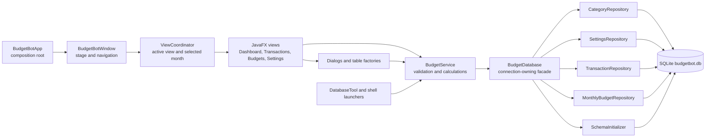

### Package responsibilities

| Package/file                      | Responsibility                                                                                                                                                                          | Important design boundary                                                                  |
|-----------------------------------|-----------------------------------------------------------------------------------------------------------------------------------------------------------------------------------------|--------------------------------------------------------------------------------------------|
| `budgetbot.BudgetBotApp`          | JavaFX lifecycle and dependency composition                                                                                                                                             | Outside the ArchUnit layer graph; it wires concrete components.                            |
| `budgetbot.DatabasePaths`         | Default per-user path and normalized optional paths                                                                                                                                     | Shared by the application and database tool.                                               |
| `budgetbot.model`                 | Immutable records and enums: `Category`, `Transaction`, `TransactionQuery`, `MonthlyBudget`, `BudgetSettings`, `DashboardSnapshot`, `CategorySummary`, `BudgetState`, `TransactionType` | Contains no application-layer dependencies. Money uses `BigDecimal`.                       |
| `budgetbot.persistence`           | SQLite connection, schema initialization, repositories, and persistence exception conversion                                                                                            | Owns SQL and may access only model classes among application layers.                       |
| `budgetbot.service.BudgetService` | Validates user-facing data, normalizes values, delegates persistence, and derives dashboard summaries                                                                                   | The application-facing boundary above persistence.                                         |
| `budgetbot.ui`                    | JavaFX window shell, coordinator, views, dialogs, table factories, alerts, and money input                                                                                              | Renders state and routes commands through the service.                                     |
| `budgetbot.tools.DatabaseTool`    | Reset and seed command implementation                                                                                                                                                   | Reuses application initialization and service paths; it does not maintain a second schema. |

### Enforced dependency rules

`src/test/java/budgetbot/architecture/ArchitectureTest.java` imports production classes, excludes tests, and enforces the following rules:

| Layer                  | Allowed access                                                                                       |
|------------------------|------------------------------------------------------------------------------------------------------|
| Model                  | May be accessed by Persistence, Service, UI, and Tools; Model does not depend on application layers. |
| Persistence            | May access Model only.                                                                               |
| Service                | May access Model and Persistence.                                                                    |
| UI                     | May access Model, Persistence exception types, and Service.                                          |
| Tools                  | May access Model, Persistence, and Service.                                                          |
| All top-level packages | Must be free of dependency cycles.                                                                   |

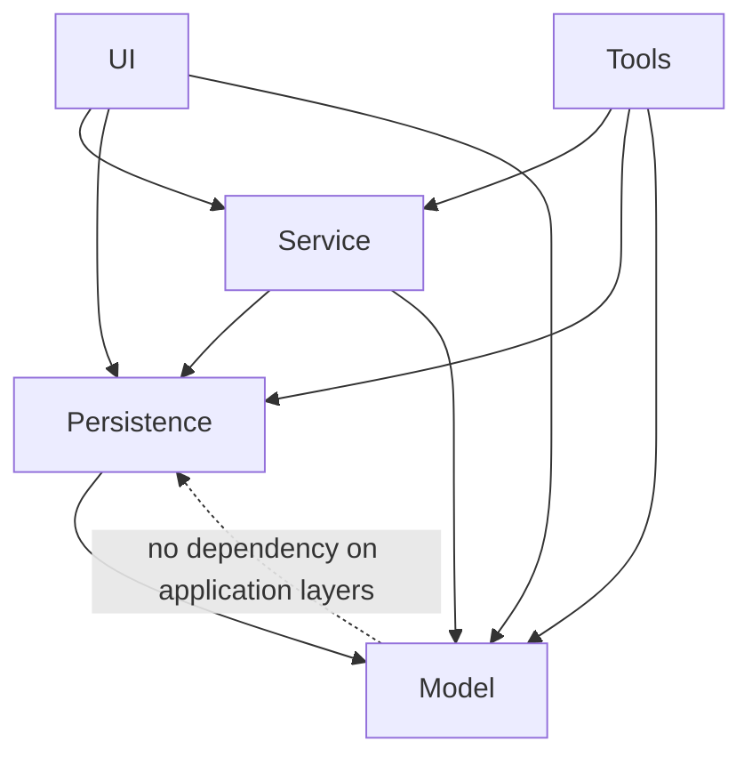

The test uses `consideringOnlyDependenciesInLayers()` so Java, JavaFX, JDBC, and other external library dependencies are not mistaken for application-layer violations. The rule that Model must not depend on Persistence, Service, Tools, or UI is checked separately.

### Startup and shutdown sequence

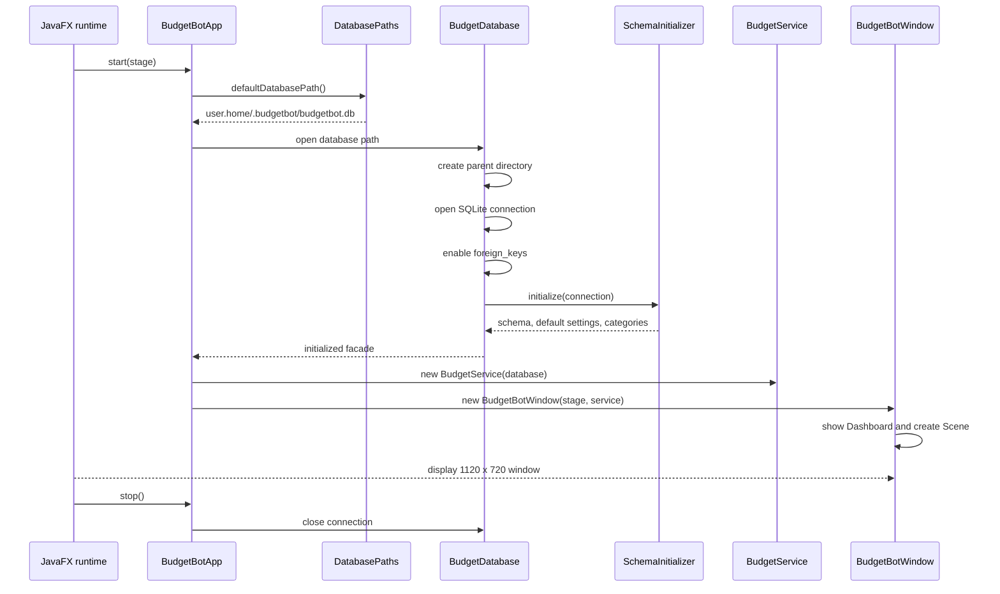

The normal scene starts at 1120 by 720 pixels and has minimum dimensions of 840 by 540. The application stylesheet is `src/main/resources/budgetbot/budgetbot.css`.

## Domain model and calculations

### Domain model

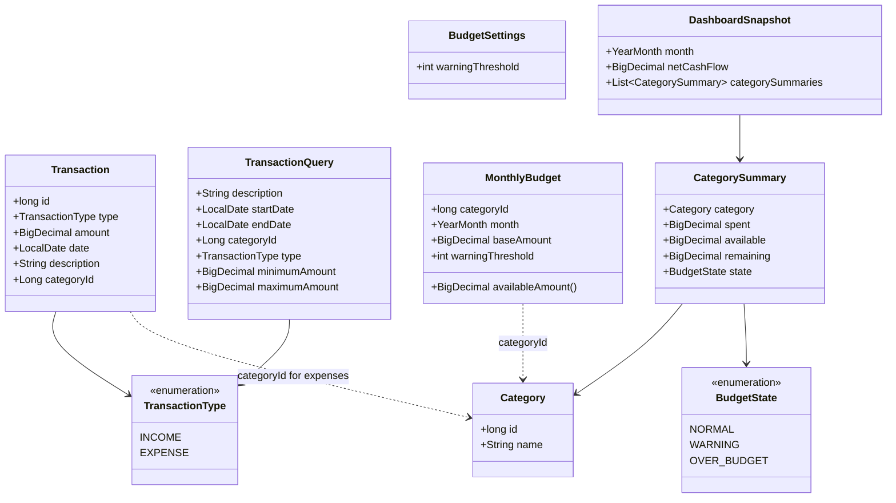

### Invariants and formulas

| Value/rule                | Definition in the current implementation                                                                                                                              |
|---------------------------|-----------------------------------------------------------------------------------------------------------------------------------------------------------------------|
| Transaction amount        | Positive `BigDecimal`; at most two decimal places. The UI accepts digits with optional one/two decimal digits.                                                        |
| Expense category          | Required for `EXPENSE`; forced to `null` for `INCOME` by service validation.                                                                                          |
| Net cash flow             | `sum(income amounts in month) - sum(expense amounts in month)`.                                                                                                       |
| Category spent            | `sum(expense amounts for category and month)`. Income never contributes to category spent.                                                                            |
| Available                 | `MonthlyBudget.baseAmount`; there is no carryover or rollover calculation.                                                                                            |
| Remaining                 | `available - spent`; it can be negative.                                                                                                                              |
| Default warning threshold | 80 percent. User setting range is 1 through 99 inclusive.                                                                                                             |
| NORMAL                    | Spending is below the warning percentage, or a zero-available category has zero spending.                                                                             |
| WARNING                   | Spending reaches the warning percentage and remains below a positive available amount.                                                                                |
| OVER_BUDGET               | Spending reaches or exceeds available with positive spending. With the current non-negative budget input, any positive spending against a zero budget is over budget. |

The state calculation checks `OVER_BUDGET` before `WARNING`, so exactly 100% is over budget rather than warning. The dashboard sorts category summaries alphabetically with case-insensitive ordering. All monetary calculations use `BigDecimal`; SQLite amount text is converted to `BigDecimal` before summing.

### Monthly snapshot lifecycle

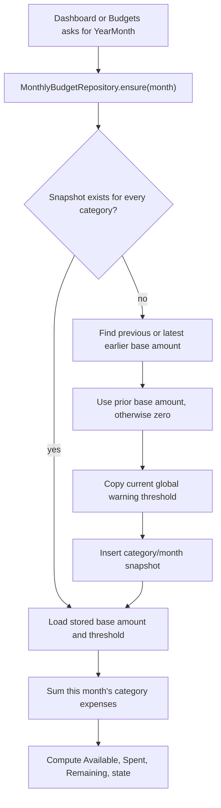

Opening a month creates missing snapshots. A newly created snapshot copies the previous month's base amount, or the latest earlier base amount, and copies the current global warning threshold. If no earlier snapshot exists, the base amount is zero. Once the snapshot exists, later settings changes do not rewrite its threshold and later-month spending does not alter its availability.

## Persistence design

### Connection lifecycle

`BudgetDatabase` creates parent directories, opens one SQLite JDBC connection, enables `PRAGMA foreign_keys = ON`, initializes the schema, and constructs the focused repositories. `BudgetBotApp.stop()` closes the connection. Tests use a temporary path, and `DatabaseTool` uses the same facade for reset and seed operations.

### SQLite schema

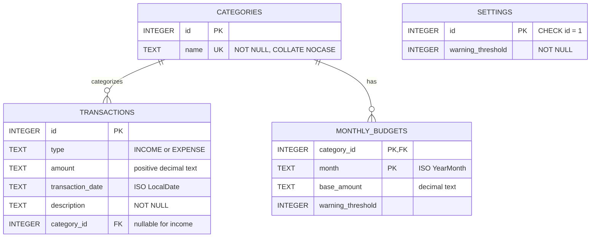

The initializer creates:

```sql
categories(id INTEGER PRIMARY KEY, name TEXT NOT NULL UNIQUE COLLATE NOCASE)
settings(id INTEGER PRIMARY KEY CHECK (id = 1), warning_threshold INTEGER NOT NULL)
transactions(id INTEGER PRIMARY KEY, type TEXT NOT NULL, amount TEXT NOT NULL,
             transaction_date TEXT NOT NULL, description TEXT NOT NULL,
             category_id INTEGER,
             FOREIGN KEY(category_id) REFERENCES categories(id))
monthly_budgets(category_id INTEGER NOT NULL, month TEXT NOT NULL,
                base_amount TEXT NOT NULL, warning_threshold INTEGER NOT NULL,
                PRIMARY KEY(category_id, month),
                FOREIGN KEY(category_id) REFERENCES categories(id) ON DELETE CASCADE)
```

The SQL above documents the schema shape; the executable statements are in `SchemaInitializer`. Amounts and dates are stored as text in canonical Java string forms so the application can reconstruct `BigDecimal`, `LocalDate`, and `YearMonth` without binary floating-point conversion.

### Repository responsibilities

| Repository                | Operations                                                                                                                                 |
|---------------------------|--------------------------------------------------------------------------------------------------------------------------------------------|
| `CategoryRepository`      | Alphabetical listing, insert, rename, and transactional reassignment/delete.                                                               |
| `SettingsRepository`      | Load and update the single settings row.                                                                                                   |
| `TransactionRepository`   | Insert/update/delete, newest-first query, filtered history query, existence check, category-month expense totals, and month net cash flow. |
| `MonthlyBudgetRepository` | Ensure snapshots exist, create snapshots from earlier base values/current threshold, load snapshots, and update a month's base amount.     |
| `SchemaInitializer`       | Create tables if absent and insert default settings/categories if absent.                                                                  |
| `PersistenceSupport`      | Convert JDBC failures to `BudgetPersistenceException` with the failed action.                                                              |

### Parameterized transaction filtering

`TransactionQuery` is an immutable model value that keeps JavaFX controls out of persistence. `BudgetService` trims description text, treats blank text as absent, validates ranges, and supplies the selected month as an implicit range only when both explicit date bounds are absent. `TransactionRepository` appends a fixed set of whitelisted clauses and binds every user value through `PreparedStatement`.

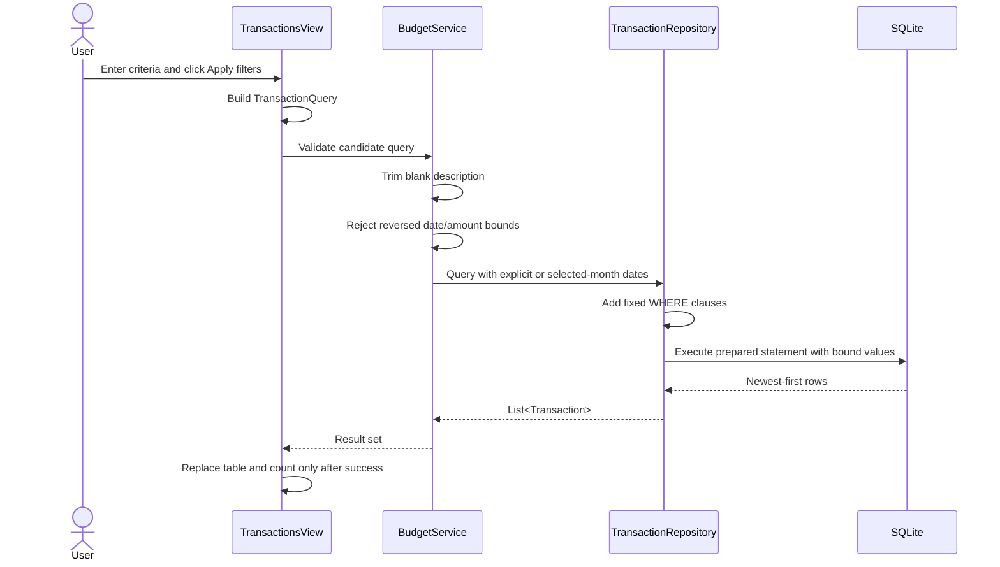

Description matching uses `LOWER(description) LIKE ?` with `%`, `_`, and backslash escaped before the substring pattern is bound. Date comparisons are inclusive. Amount comparisons cast the stored decimal text and bound decimal text to SQLite numeric values. Ordering is `transaction_date DESC, id DESC`.

### Category removal transaction

When a category is removed, the UI requires a different replacement category. `CategoryRepository.remove` disables auto-commit, updates all transaction references, deletes the category, commits, and restores auto-commit. If a SQL failure occurs, it rolls back before reporting the persistence failure. The service separately prevents removal when only one category remains.

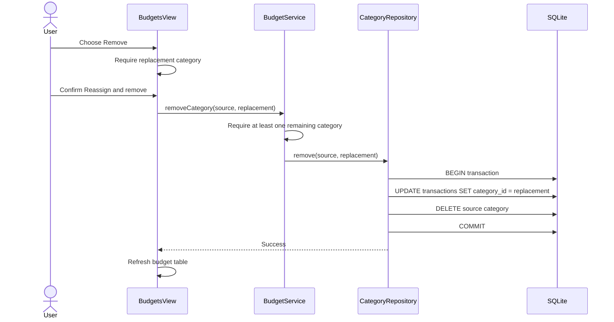

### Schema compatibility

The current schema is the simplified pre-release schema. It has no migration implementation for obsolete development databases. If an old development file cannot be opened by the current build, back it up if necessary and recreate it with the reset launcher or by removing the `.budgetbot` directory. Native application upgrades preserve a compatible current database; reset is the explicitly destructive operation.

## JavaFX presentation design

### Window and view coordination

`BudgetBotWindow` owns the `Stage`, left navigation, `BorderPane`, scene dimensions, title, and stylesheet. `ViewCoordinator` owns the active view enum and shared `YearMonth`. It constructs the four views and rerenders the active view after navigation or month changes. The coordinator intentionally refreshes the current tab when `<` or `>` is selected.

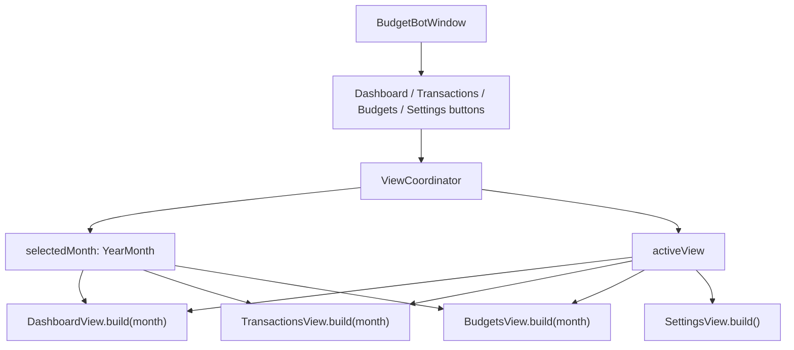

### View and reusable-component map

| Component                   | UI responsibility                                                                                             |
|-----------------------------|---------------------------------------------------------------------------------------------------------------|
| `DashboardView`             | Gets `DashboardSnapshot`, renders Net cash flow and a read-only budget table.                                 |
| `TransactionsView`          | Builds filter controls, applies/clears queries, shows count and table, and routes add/edit/delete operations. |
| `BudgetsView`               | Renders category budget summaries and routes add, set-budget, rename, and remove operations.                  |
| `SettingsView`              | Renders the 1–99 warning-threshold spinner and saves the setting.                                             |
| `MonthControls`             | Reusable previous/current/next month control for month-oriented views.                                        |
| `TransactionDialog`         | Add/edit form with type, amount, date, description, category, and wrapped validation.                         |
| `CategoryDialog`            | Required-text add/rename form and replacement-category removal form.                                          |
| `BudgetDialog`              | Validated monetary input for monthly base amounts; zero is allowed.                                           |
| `TransactionTableFactory`   | Date/type/description/category/amount columns, semantic income/expense colours, and row actions.              |
| `BudgetSummaryTableFactory` | Category summary columns, semantic Remaining colours, and category actions.                                   |
| `MoneyInput`                | Parses permitted monetary text and formats values as two-decimal dollar strings.                              |
| `UiAlerts`                  | Shared confirmation, information, and persistence/validation error alerts.                                    |

### UI state and mutation refresh

The Transactions view holds `appliedQuery` in the view instance. Apply first validates and successfully retrieves the candidate; only then does it replace `appliedQuery`, the table, and the count. Clear sets an empty query, clears every control, and refreshes the selected-month result. Successful add/edit/delete reruns the last successful query, which means a row can disappear if a mutation makes it stop matching.

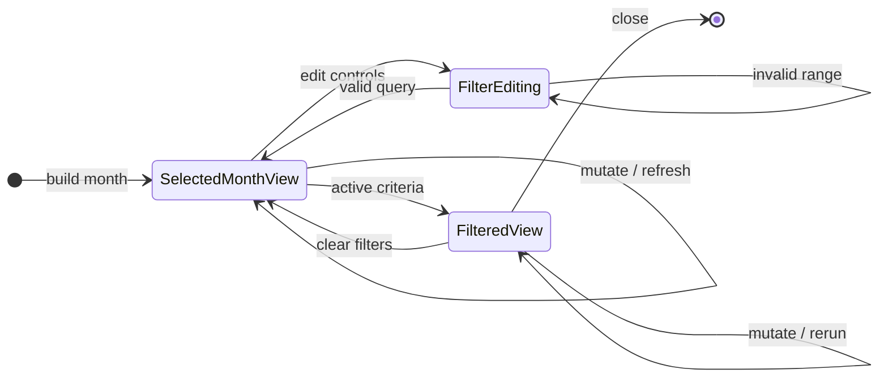

### Validation and readable feedback

The service is the final validation boundary even when the UI validates first. The principal rules are:

| Input               | Service/UI rule                                                             | User-visible outcome                                                               |
|---------------------|-----------------------------------------------------------------------------|------------------------------------------------------------------------------------|
| Transaction type    | Required; must be `INCOME` or `EXPENSE`                                     | `Select income or expense.` at the service boundary.                               |
| Transaction amount  | Required, positive, at most two decimal places                              | UI and service reject blank, zero, negative, malformed, or over-precise values.    |
| Transaction date    | Required                                                                    | The dialog remains open when absent.                                               |
| Expense category    | Required for `EXPENSE`; removed for `INCOME`                                | UI disables category for income; service normalizes income category to `null`.     |
| Monthly base amount | Non-negative, at most two decimal places                                    | Zero is valid; negative or over-precise values are rejected.                       |
| Warning threshold   | Integer 1–99                                                                | Settings save is rejected outside this range.                                      |
| Filter dates        | Start must not be after end                                                 | Previous query results remain unchanged.                                           |
| Filter amounts      | Min must not exceed max; each must be non-negative and at most two decimals | Previous query results remain unchanged.                                           |
| Category name       | Trimmed and non-blank; database name is case-insensitively unique           | Dialog remains open for blank text; persistence errors are alerted for duplicates. |

Transaction and budget validation feedback uses a finite-width JavaFX `TextFlow`. After a validation message changes, `Platform.runLater` requests layout and calls `sizeToScene()` so wrapping does not hide Save or Cancel. The budget form uses a 320-pixel content width; the transaction validation flow uses 300 pixels. This is covered by UI tests that inspect rendered height and button bounds.

## Developer database tooling

### Public launcher commands

Windows PowerShell:

```powershell
.\scripts\reset-database.ps1
.\scripts\seed-demo-data.ps1
```

macOS/Linux:

```sh
sh scripts/reset-database.sh
sh scripts/seed-demo-data.sh
```

The Windows PowerShell reset script prompts for the literal `RESET` unless `-Force` is supplied. The POSIX reset script always prompts and accepts at most one path argument. Both scripts delegate to the Gradle `databaseTool` JavaExec task. The Java command accepts `reset --force [--database <path>]` or `seed [--database <path>]`, reports the normalized target, and returns non-zero exit codes for rejected or failed operations.

Both launchers accept an optional disposable database path. This is useful for testing the database tool without touching the normal data file:

```powershell
.\scripts\reset-database.ps1 -Force -DatabasePath "$env:TEMP\budgetbot-demo.db"
.\scripts\seed-demo-data.ps1 -DatabasePath "$env:TEMP\budgetbot-demo.db"
```

```sh
sh scripts/reset-database.sh /tmp/budgetbot-demo.db
sh scripts/seed-demo-data.sh /tmp/budgetbot-demo.db
```

The desktop application itself always uses the default per-user path; passing a custom path to a script does not change the application's path selection.

### Reset implementation

Reset permanently deletes the selected database and its matching SQLite `-wal`, `-shm`, and `-journal` sidecar files. It then runs the same database initialization used by the application.

On Windows PowerShell:

```powershell
.\scripts\reset-database.ps1
```

Type the literal `RESET` at the prompt. For an automated or already-approved reset, use:

```powershell
.\scripts\reset-database.ps1 -Force
```

On macOS/Linux:

```sh
sh scripts/reset-database.sh
```

Type `RESET` at the prompt. The POSIX launcher does not accept a force flag.

After reset, run BudgetBot normally. The reset launcher prints the normalized target before it changes anything.


### Seed data

Seed opens the target, refuses to proceed if any transaction exists, locates the named default categories, sets five current-month budgets, and inserts two income plus five expense transactions.

```powershell
# Windows PowerShell
.\scripts\seed-demo-data.ps1
```

```sh
# macOS/Linux
sh scripts/seed-demo-data.sh
```

Seed uses the current calendar month at the time it runs. The scenario contains the following values:

| Date in current month | Type    | Description          | Category            |      Amount |
|-----------------------|---------|----------------------|---------------------|------------:|
| Day 1                 | Income  | Salary               | —                   | `$4,500.00` |
| Day 8                 | Income  | Freelance work       | —                   |   `$250.00` |
| Day 2                 | Expense | Rent                 | Housing & Utilities | `$1,500.00` |
| Day 5                 | Expense | Weekly groceries     | Groceries           |   `$250.00` |
| Day 10                | Expense | Lunches with friends | Dining              |    `$80.00` |
| Day 12                | Expense | Transit pass         | Transport           |   `$120.00` |
| Day 15                | Expense | Cinema               | Entertainment       |    `$60.00` |

It also sets these current-month base budgets:

| Category            | Base amount |
|---------------------|------------:|
| Housing & Utilities | `$1,600.00` |
| Groceries           |   `$400.00` |
| Dining              |   `$180.00` |
| Transport           |   `$180.00` |
| Entertainment       |   `$120.00` |

The expected current-month net cash flow is `$2,740.00` (`$4,750.00 - $2,010.00`). Housing & Utilities is at the warning state at the default 80% threshold; it is below its `$1,600.00` available amount. The other seeded budgeted categories are below the warning threshold.

Seed refuses to add a second scenario if the target already contains any transactions. It reports that reset is required and leaves the existing data unchanged.

## Software engineering process

### Change lifecycle

The project uses a lightweight, source-controlled OpenSpec workflow for non-trivial changes. The intended lifecycle is:

```mermaid
flowchart LR
    Need["Problem or product idea"] --> Proposal["Proposal\nwhy, scope, impact"]
    Proposal --> Design["Design\narchitecture and trade-offs"]
    Design --> Spec["Specification\nacceptance scenarios"]
    Spec --> Tasks["Tasks\nsmall implementation units"]
    Tasks --> Implement["Implement\ncode and tests"]
    Implement --> Verify["Verify\nquality gate and review"]
    Verify --> Sync["Sync delta specs\nwhen required"]
    Sync --> Archive["Archive completed change"]
    Verify -. failure .-> Implement
```

Each archived change keeps `proposal.md`, `design.md`, `tasks.md`, and any delta specifications together. The current archive records:

| Archived change                                 | Scope                                                                    | Recorded tasks |
|-------------------------------------------------|--------------------------------------------------------------------------|---------------:|
| `2026-08-20-add-budgetbot-desktop-app`          | Initial JavaFX desktop budget tracker                                    |          19/19 |
| `2026-08-21-simplify-monthly-dashboard`         | Month-focused Net cash flow, fixed availability, no rollover             |          11/11 |
| `2026-08-21-add-database-test-scripts`          | Cross-platform reset/seed tooling                                        |          11/11 |
| `2026-08-21-add-desktop-release-packaging`      | Native packaging and GitHub Release automation                           |          13/13 |
| `2026-08-23-add-transaction-search-and-filters` | Search, composable filters, responsive controls, and validation feedback |          31/31 |

The design artifacts record rejected alternatives as well as selected solutions. Examples include using a service/repository query instead of UI-only filtering, selecting month-scoped Net cash flow instead of lifetime Overall balance, removing rollover from an unreleased schema instead of preserving obsolete fields, and keeping release packaging for all three operating systems while isolating the hosted macOS TestFX limitation.

### Contribution workflow

`CONTRIBUTING.md` is the contributor-facing contract:

1. Install JDK 25 and clone the repository.
2. Create a short-lived branch from the default branch.
3. Make one focused change.
4. Add or update tests for changed behaviour.
5. Run Spotless and the quality checks.
6. Update relevant Javadoc and user/developer documentation.
7. Open a pull request describing the problem, solution, tests run, and follow-up work.

Commit summaries use Conventional Commits with types such as `feat`, `fix`, `docs`, `test`, `refactor`, `build`, `ci`, `chore`, and `perf`. This makes the history readable and separates product, verification, build, and documentation changes.

### Definition of done

A change is ready for review when:

- the intended behaviour is represented by an acceptance scenario or an explicit documentation decision;
- implementation follows the package boundaries and does not add a second source of truth;
- normal, boundary, invalid-input, persistence, and relevant UI paths have tests;
- Java formatting, Checkstyle, PMD, SpotBugs/FindSecBugs, architecture rules, coverage, and Javadoc are checked as applicable;
- user-facing labels, validation, setup steps, and limitations are documented;
- `git diff --check` is clean; and
- the Docusaurus site builds when documentation or website files change.

## Testing strategy

### Test levels

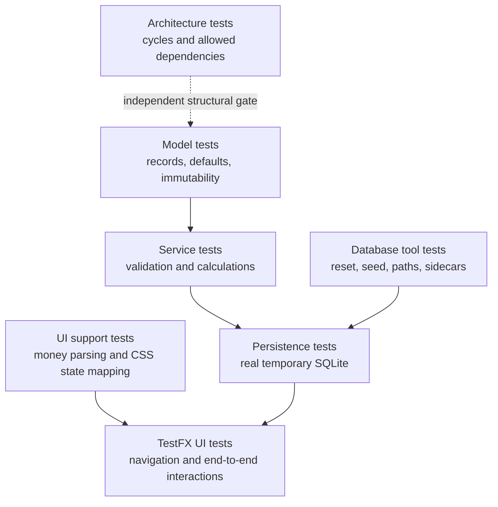

The tests use isolated temporary SQLite files rather than the developer's default database. `BudgetBotWindowUiTest` uses TestFX's `ApplicationExtension`, `FxRobot`, JavaFX event waits, and a temporary database seeded in the test setup. This prevents a test run from changing a developer's personal BudgetBot data.

### Test inventory

The current source contains 43 JUnit/TestFX tests:

| Test class              |  Count | Evidence                                                                                                                                                                                        |
|-------------------------|-------:|-------------------------------------------------------------------------------------------------------------------------------------------------------------------------------------------------|
| `ArchitectureTest`      |      3 | No package cycles, allowed layered dependencies, and model isolation.                                                                                                                           |
| `BudgetBotAppTest`      |      1 | Stable default database path under the user's home.                                                                                                                                             |
| `ModelTest`             |      4 | Defaults, required record values, description normalization, immutable snapshot list, enum/query values.                                                                                        |
| `BudgetDatabaseTest`    |      6 | Directory/schema/default initialization, reopen persistence, category reassignment, transaction CRUD/totals, fixed monthly snapshots, every filter criterion and inclusive bounds.              |
| `BudgetServiceTest`     |     14 | Default data, income/expense calculations, warning/over-budget boundaries, no carryover, category rules, validation, CRUD normalization, month scoping, query normalization and invalid bounds. |
| `DatabaseToolTest`      |      4 | Path normalization, protected reset, sidecar removal/first-start recreation, deterministic seed and duplicate protection.                                                                       |
| `BudgetBotWindowUiTest` |      8 | View navigation, month changes, transaction CRUD, transaction/budget validation feedback, filters, mutation refresh, responsive filter coordination, category/budget/settings actions.          |
| `UiSupportTest`         |      3 | Monetary parsing/formatting and all budget-state CSS mappings.                                                                                                                                  |
| **Total**               | **43** | Current recorded inventory; rerun the build after source changes.                                                                                                                               |

### Risk-based coverage priorities

| Risk                                         | Mitigation and evidence                                                                                                            |
|----------------------------------------------|------------------------------------------------------------------------------------------------------------------------------------|
| Money rounding or sign errors                | `BigDecimal`, explicit positive/non-negative validation, unit tests for net cash flow, totals, formatting, and two-decimal limits. |
| Cross-month calculation errors               | `YearMonth` boundaries in service/repository tests and month navigation UI coverage.                                               |
| Historical budget drift                      | Stored monthly snapshots and tests proving no spending/carryover changes later availability.                                       |
| Orphaned category references                 | Foreign keys, replacement-required UI, transactional reassignment, and persistence/service tests.                                  |
| SQL injection or query parameter misordering | Fixed SQL fragments, `PreparedStatement` binding, escaped LIKE patterns, and independent/combined criterion tests.                 |
| Filters losing data or state                 | Validate before replacing results, preserve active query after mutations, result-count/empty-state UI tests.                       |
| Clipped validation feedback                  | Finite-width `TextFlow`, post-layout `sizeToScene`, and TestFX button-bound checks.                                                |
| Layer erosion                                | ArchUnit cycle and dependency rules.                                                                                               |
| Regressions missed by manual review          | CI runs tests, static checks, coverage verification, Javadoc, and Docusaurus build.                                                |
| Unsafe demo reset                            | Explicit confirmation/force, normalized target output, exact sidecar deletion, and target-path tests.                              |

### Local verification commands

From the repository root:

```powershell
# Windows PowerShell
.\gradlew.bat spotlessApply
.\gradlew.bat test
.\gradlew.bat check
.\gradlew.bat jacocoTestReport
.\gradlew.bat javadoc
```

```sh
# macOS/Linux
./gradlew spotlessApply
./gradlew test
./gradlew check
./gradlew jacocoTestReport
./gradlew javadoc
```

Use `--offline` only when all required Gradle distributions and dependencies are already cached. A passing `test` task alone is not the full project quality gate.

### Quality tasks and reports

| Task/tool                          | Purpose                                                                           | Output or failure policy                                                                                        |
|------------------------------------|-----------------------------------------------------------------------------------|-----------------------------------------------------------------------------------------------------------------|
| `spotlessApply` / `spotlessCheck`  | Apply or verify Google Java Format for `src/*/java/**/*.java`.                    | Formatting changes must be reviewed; `spotlessCheck` is used in CI/release jobs.                                |
| `checkstyleMain`, `checkstyleTest` | Run the configured Checkstyle rules.                                              | Configuration is in `config/checkstyle/checkstyle.xml`.                                                         |
| `pmdMain`                          | Run the selected best-practice and error-prone PMD categories on production code. | `pmdTest` is disabled because the selected production ruleset is not the test-source contract.                  |
| `spotbugsMain`                     | Run SpotBugs with FindSecBugs at maximum effort and medium confidence.            | Findings fail the build; HTML/XML reports are under `build/reports/spotbugs/`. `spotbugsTest` is disabled.      |
| `test`                             | Run JUnit Platform tests, including TestFX and ArchUnit.                          | Tests must pass.                                                                                                |
| `jacocoTestCoverageVerification`   | Enforce bundle instruction coverage.                                              | Minimum `INSTRUCTION` `COVEREDRATIO` is 0.80 and it is attached to `check`.                                     |
| `jacocoTestReport`                 | Generate HTML/XML coverage.                                                       | HTML index: `build/reports/jacoco/test/html/index.html`; XML: `build/reports/jacoco/test/jacocoTestReport.xml`. |
| `openJacocoReport`                 | Generate and open the HTML report.                                                | Uses `cmd /c start`, `open`, or `xdg-open` by operating system.                                                 |
| `javadoc` / `openJavadoc`          | Generate and optionally open API documentation.                                   | Output is under `build/docs/javadoc/`.                                                                          |
| `git diff --check`                 | Detect whitespace errors in the final diff.                                       | A scoped documentation/code hygiene check, not a substitute for compilation or tests.                           |

### Coverage summary transformation

`scripts/summarize_jacoco.py` reads JaCoCo XML and produces a Markdown table with package rows sorted by missed instructions plus a Total row. It includes missed/total and percentage values for instructions and branches, plus complexity, line, method, and class totals. Locally:

```text
python3 scripts/summarize_jacoco.py
```

CI passes `--step-summary` and `--github-output`. The generated summary is written to `GITHUB_STEP_SUMMARY` and exposed to the same-repository pull-request comment step. The sticky comment is identified by `<!-- budgetbot-jacoco-coverage -->`. Fork pull requests keep the workflow summary and artifact but do not receive a comment because their token is read-only.

## Continuous integration, documentation, and delivery

### Normal CI

`.github/workflows/ci.yml` runs for pull requests, pushes to `main`, and manual dispatch. It:

1. checks out the repository;
2. provisions Temurin JDK 25 and Node.js 24;
3. makes `gradlew` executable on Linux/macOS runners;
4. runs `xvfb-run --auto-servernum ./gradlew check jacocoTestReport javadoc`;
5. transforms the JaCoCo XML into a report-like Markdown table;
6. updates the sticky same-repository pull-request coverage comment when permissions allow;
7. installs documentation dependencies with `npm ci`;
8. builds the Docusaurus site; and
9. uploads `build/reports/` as the `quality-reports` artifact.

The ordinary workflow has `contents: read` and `pull-requests: write`; it cannot publish a GitHub Release.

### GitHub Pages documentation

`.github/workflows/pages.yml` runs on `main` when `docs/**`, `website/**`, or the Pages workflow changes, and also supports manual dispatch. It installs Node.js 24, runs `npm ci`, builds `website`, uploads `website/build` as a Pages artifact, and deploys through the `github-pages` environment.

The Docusaurus configuration:

- reads the repository root as its documentation source;
- includes `README.md` and `docs/**/*.md`;
- excludes `docs/Reflections.md` from the published site because it is an assessment reflection;
- renders README at `/`, Developer Guide at `/DeveloperGuide`, and User Guide at `/UserGuide`;
- enables Mermaid code fences with `markdown.mermaid: true` and loads `@docusaurus/theme-mermaid`;
- installs `@mermaid-js/layout-elk` explicitly so the Docusaurus Mermaid client bundle can resolve its optional ELK layout peer; and
- enables Prism's built-in `gherkin` language through `themeConfig.prism.additionalLanguages`, so `Feature`, `Scenario`, `Given`, `When`, `Then`, `And`, and `But` receive syntax highlighting; and
- uses `onBrokenLinks: 'throw'`; and
- derives the GitHub repository link and Pages base URL from Actions environment variables when available.

To preview locally:

```text
cd website
npm ci
npm start
```

To run the production documentation check:

```text
cd website
npm run build
```

The Mermaid blocks in this guide are source-controlled diagrams. GitHub renders Mermaid fences natively, and the Docusaurus site renders them through `@docusaurus/theme-mermaid`. Add a fenced block with the `mermaid` language when documenting a new diagram; `npm run build` is the production smoke test for parsing and bundling these diagrams.

### Dependency updates

`.github/dependabot.yml` checks the Gradle ecosystem at `/`, npm dependencies at `/website`, and GitHub Actions dependencies at `/`, each weekly. Generated lockfile changes and major tool upgrades still require the normal review and quality gate.

## Distribution and release workflow

### Executable FAT JAR

The `releaseJar` task delegates to Gradle Shadow's `shadowJar` task and creates `release/BudgetBot.jar`:

```powershell
# Windows PowerShell
.\gradlew.bat clean releaseJar
java -jar release\BudgetBot.jar
```

```sh
# macOS/Linux
./gradlew clean releaseJar
java -jar release/BudgetBot.jar
```

The manifest starts `BudgetBotLauncher`, a plain Java entry point which delegates to `BudgetBotApp`. This avoids the Java launcher treating the bundled JavaFX application class as a JavaFX module-path launch. Shadow merges the application and runtime classpath, including SQLite JDBC and JavaFX. Explicit
`javafx-graphics` classifiers contribute the x86-64 native libraries for Windows, Linux, and Intel macOS. `Enable-Native-Access: ALL-UNNAMED` in the manifest allows JavaFX to load those native libraries when users run the plain`java -jar` command.

The FAT JAR includes application dependencies but not a Java runtime. Users therefore need Java 25 or newer. ARM targets need a corresponding architecture-specific JavaFX build or should use the native installer produced for that platform.

### Local native packaging

Native packaging requires a full JDK 25 with `jpackage`; a runtime-only JDK is insufficient. The Windows MSI path additionally requires WiX Toolset on `PATH`.

```powershell
# Windows PowerShell
.\gradlew.bat packageAppImage "-PreleaseVersion=1.2.3"
.\gradlew.bat packageNative "-PreleaseVersion=1.2.3"
```

```sh
# macOS/Linux
./gradlew packageAppImage -PreleaseVersion=1.2.3
./gradlew packageNative -PreleaseVersion=1.2.3
```

`releaseVersion` must match digits in `<major>.<minor>.<patch>` form. `packageAppImage` creates a self-contained application image under `build/jpackage/app-image/`. `packageNative` detects the host operating system, calls `jpackage`, verifies that exactly one native installer was produced, and copies it to `build/packages/` with one of these names:

```text
BudgetBot-1.2.3-windows.msi
BudgetBot-1.2.3-macos.dmg
BudgetBot-1.2.3-linux.deb
```

The package contains the Java runtime and JavaFX modules needed to launch the app. It does not contain the user's `~/.budgetbot/budgetbot.db` file.

macOS `jpackage` rejects an internal app version whose first component is zero. The build maps only the internal DMG app version from `0.x.y` to `1.x.y`; public tag, release name, asset filename, and Windows/Linux package version remain `0.x.y`.

### Release sequence

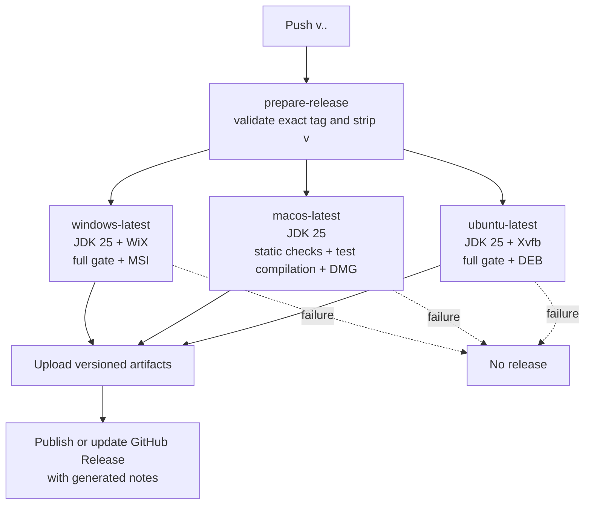

`.github/workflows/release.yml` is triggered by version tags and validates the exact `v<major>.<minor>.<patch>` form before packaging. The matrix uses `windows-latest` for MSI, `macos-latest` for DMG, and `ubuntu-latest` for DEB. Every package job uses JDK 25 and the Gradle Wrapper.

The Windows job runs formatting, `check`, coverage, Javadoc, and native packaging. The Ubuntu job runs the same quality path under Xvfb. The macOS job runs formatting, Checkstyle, production PMD, test compilation, Javadoc, and packaging; it does not run the full TestFX runtime suite because hosted macOS ARM has exhibited native graphics/pointer/modal failures. This preserves macOS packaging coverage without claiming unverified UI-runtime compatibility.

The publish job waits for every required matrix entry. It downloads the three artifacts and uses `softprops/action-gh-release@v3` to publish one release with generated notes. It has `contents: write`; the prepare/package jobs and normal CI are read-only. A failed quality or package job prevents publication of a partial release.

## Requirements-to-implementation mapping

This matrix maps a direct route from requirement to implementation and automated evidence.

| Requirement                                       | Implementation evidence                                                                                 | Automated evidence                                                                         |
|---------------------------------------------------|---------------------------------------------------------------------------------------------------------|--------------------------------------------------------------------------------------------|
| Local single-user app persists without an account | `BudgetBotApp`, `DatabasePaths`, `BudgetDatabase`, `SchemaInitializer`                                  | `BudgetBotAppTest`, `BudgetDatabaseTest` initialization/reopen tests                       |
| Default and configurable categories               | `SchemaInitializer`, `CategoryRepository`, `CategoryDialog`, `BudgetsView`                              | `BudgetServiceTest`, `BudgetDatabaseTest`, UI category workflow                            |
| Income/expense CRUD and validation                | `Transaction`, `BudgetService`, `TransactionRepository`, `TransactionDialog`, `TransactionTableFactory` | service validation/CRUD tests, persistence CRUD test, TestFX CRUD/validation tests         |
| Selected-month net cash flow                      | `TransactionRepository.netCashFlow`, `BudgetService.dashboard`, `DashboardView`                         | month-scoped and empty-month service tests, UI Dashboard assertion                         |
| Fixed monthly budgets and statuses                | `MonthlyBudget`, `MonthlyBudgetRepository`, `BudgetService.stateFor`, `BudgetSummaryTableFactory`       | state boundary/no-carryover service and persistence tests                                  |
| Future warning threshold                          | `BudgetSettings`, `SettingsRepository`, `SettingsView`, monthly snapshot creation                       | settings and snapshot tests, UI settings workflow                                          |
| Search/filter history                             | `TransactionQuery`, `BudgetService.transactions`, `TransactionRepository.find`, `TransactionsView`      | independent/combined/inclusive/one-sided service and persistence tests; TestFX filters     |
| Safe category reassignment/removal                | `CategoryRepository.remove` transaction, service final-category guard, replacement dialog               | persistence/service category tests, UI management test                                     |
| Repeatable database setup                         | `DatabaseTool`, `DatabasePaths`, `scripts/*.ps1`, `scripts/*.sh`, Gradle `databaseTool`                 | `DatabaseToolTest` reset/seed/path/sidecar tests                                           |
| Quality and structural enforcement                | Gradle configuration, `config/`, `ArchitectureTest`, `scripts/summarize_jacoco.py`                      | `check`, coverage verification, reports, CI                                                |
| Cross-platform packaged delivery                  | `releaseJar`, `shadowJar`, `packageAppImage`, `packageNative`, release matrix                           | FAT JAR inspection and Windows launch; Windows/Ubuntu full gate; macOS static/package path |
| Requirements/design/process visibility            | `openspec/changes/archive`, `openspec/specs`, `CONTRIBUTING.md`, docs site                              | archived task completion, CI documentation build                                           |

## Known limitations and future work

The following limitations are explicit so that they are not mistaken for undocumented bugs:

- the application is local and single-user;
- there is no account, network synchronization, bank integration, import/export, or in-app backup/restore;
- data from obsolete unreleased development schemas has no migration path;
- packages are unsigned and macOS packages are not notarized;

## Acknowledgements

This section records the external frameworks, conventions, project artifacts, and design material reused by the implementation or this documentation.

### External libraries and tool documentation

| Source                                                                                                                                                                 | Reused runtime/tooling or convention                                                                                                        |
|------------------------------------------------------------------------------------------------------------------------------------------------------------------------|---------------------------------------------------------------------------------------------------------------------------------------------|
| [OpenJFX](https://openjfx.io/)                                                                                                                                         | JavaFX Controls desktop UI and JavaFX application lifecycle.                                                                                |
| [Gradle Wrapper documentation](https://docs.gradle.org/current/userguide/gradle_wrapper.html)                                                                          | Wrapper-based, reproducible build invocation.                                                                                               |
| [Gradle Shadow](https://gradleup.com/shadow/)                                                                                                                          | Executable FAT JAR assembly, dependency/resource merging, and manifest configuration.                                                       |
| [SQLite documentation](https://www.sqlite.org/docs.html) and [Xerial SQLite JDBC](https://github.com/xerial/sqlite-jdbc)                                               | Embedded database model, JDBC access, SQLite sidecar awareness, and driver dependency.                                                      |
| [JUnit 5/Jupiter](https://junit.org/junit5/)                                                                                                                           | Test structure, assertions, lifecycle, and JUnit Platform execution.                                                                        |
| [Mockito](https://site.mockito.org/), [Hamcrest](https://hamcrest.org/), and [TestFX](https://github.com/TestFX/TestFX)                                                | Declared test dependencies and TestFX JavaFX interaction conventions; current tests mainly use real temporary storage and JUnit assertions. |
| [ArchUnit](https://www.archunit.org/)                                                                                                                                  | Architecture-rule vocabulary and package dependency verification.                                                                           |
| [Spotless](https://github.com/diffplug/spotless) and [Google Java Format](https://github.com/google/google-java-format)                                                | Automated Java formatting.                                                                                                                  |
| [Checkstyle](https://checkstyle.org/), [PMD](https://pmd.github.io/), [SpotBugs](https://spotbugs.github.io/), and [FindSecBugs](https://find-sec-bugs.github.io/)     | Static style, best-practice, bug, and security analysis tools.                                                                              |
| [JaCoCo](https://www.jacoco.org/jacoco/)                                                                                                                               | Coverage counters, HTML/XML reports, and the instruction-coverage gate.                                                                     |
| [Docusaurus](https://docusaurus.io/)                                                                                                                                   | Markdown documentation site structure and GitHub Pages publication.                                                                         |
| [GitHub Actions](https://docs.github.com/en/actions), [GitHub Pages](https://pages.github.com/), and [Dependabot](https://docs.github.com/en/code-security/dependabot) | CI, documentation deployment, release automation, and dependency-update workflows.                                                          |
| [Mermaid](https://mermaid.js.org/) and [Docusaurus diagrams](https://docusaurus.io/docs/markdown-features/diagrams)                                                    | Diagram notation and the Docusaurus renderer used by the diagrams in this guide.                                                            |
| [Cucumber Gherkin reference](https://cucumber.io/docs/gherkin/reference/)                                                                                              | `Feature`, `Scenario`, `Given`, `When`, `Then`, `And`, and related living-specification syntax.                                             |
| [Connextra](https://www.connextra.com/)                                                                                                                                | The `As a ..., I want ..., so that ...` user-story sentence format.                                                                         |
