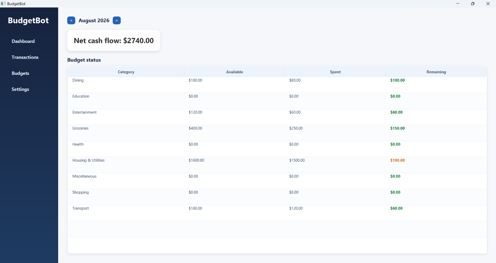
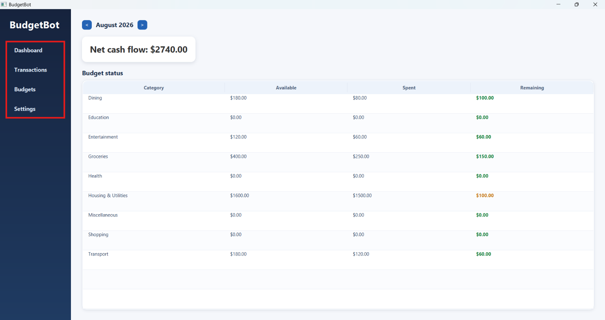
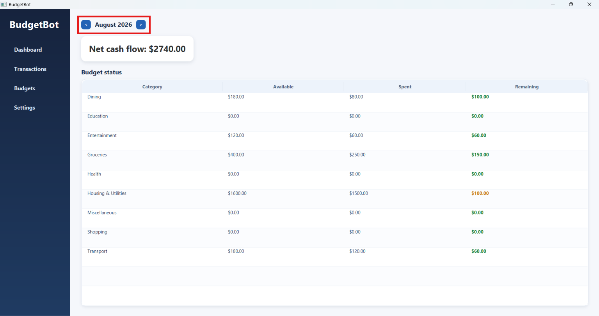
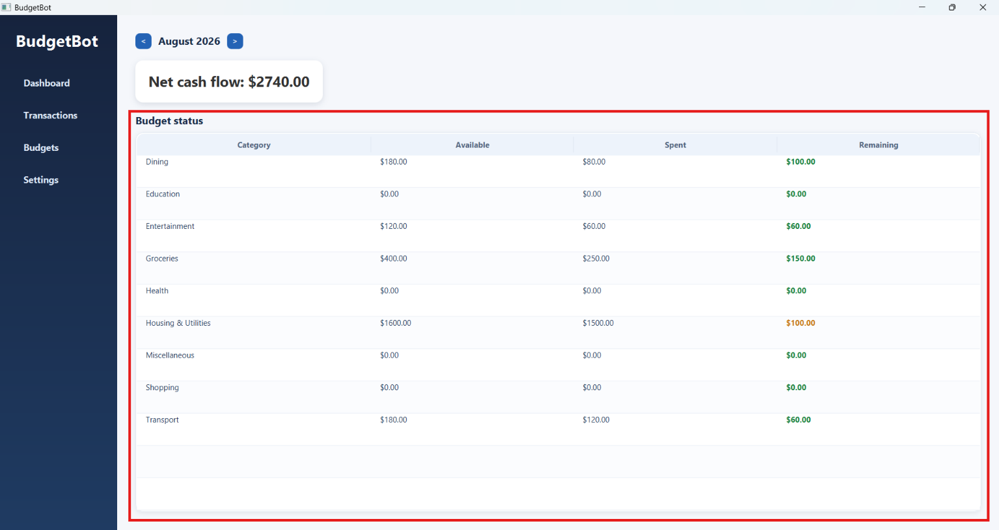
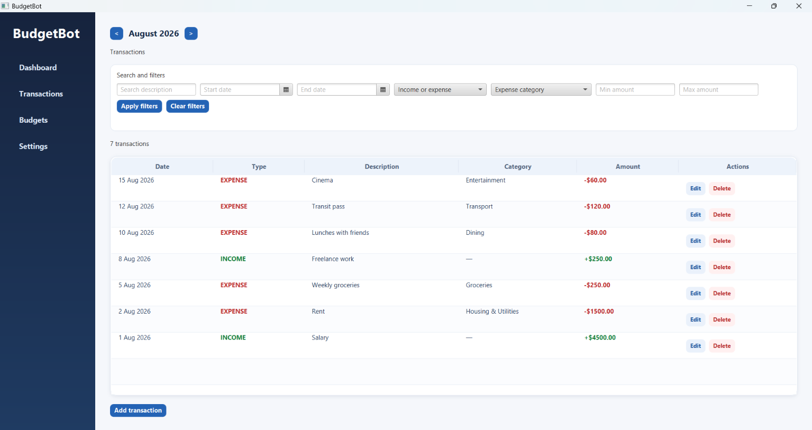
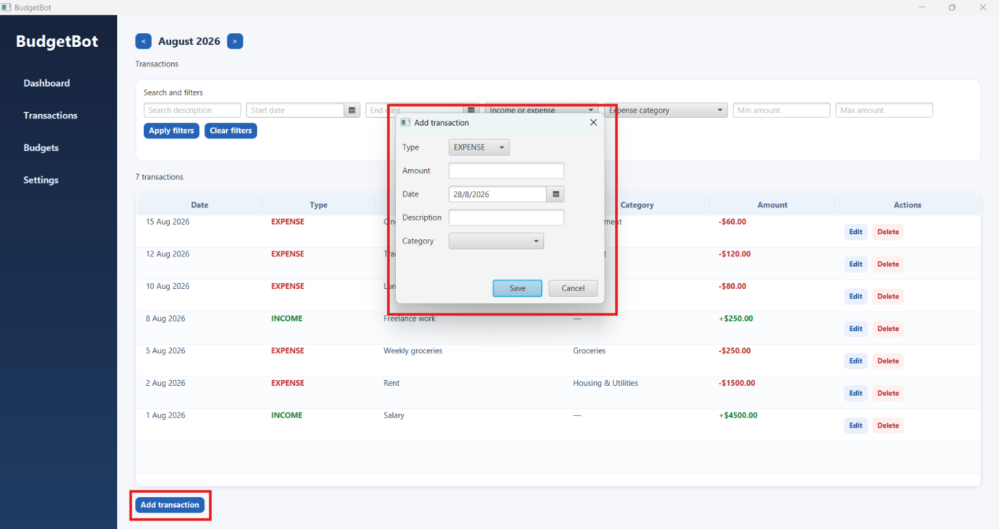
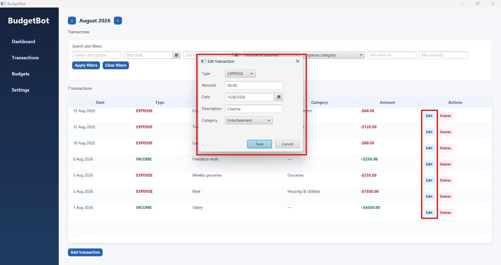
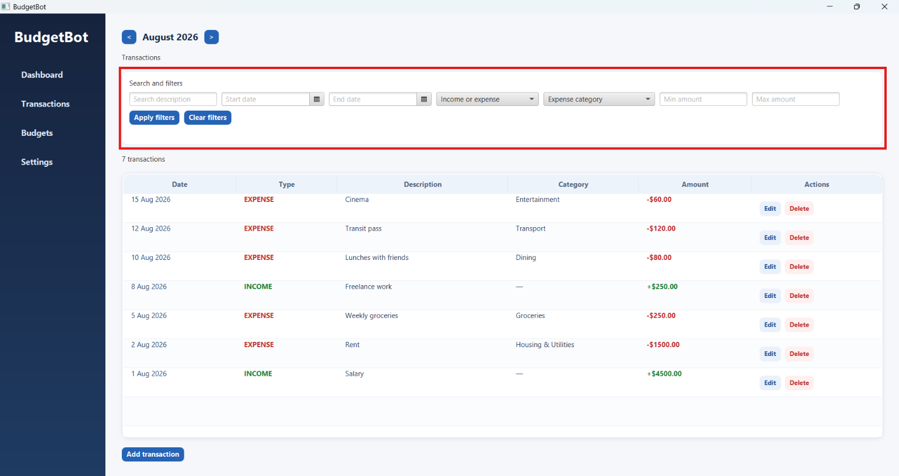
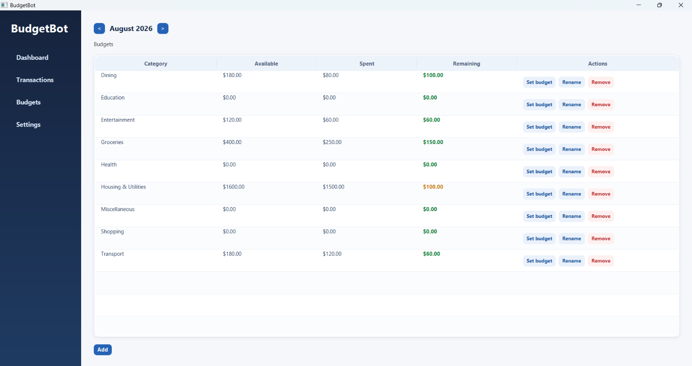
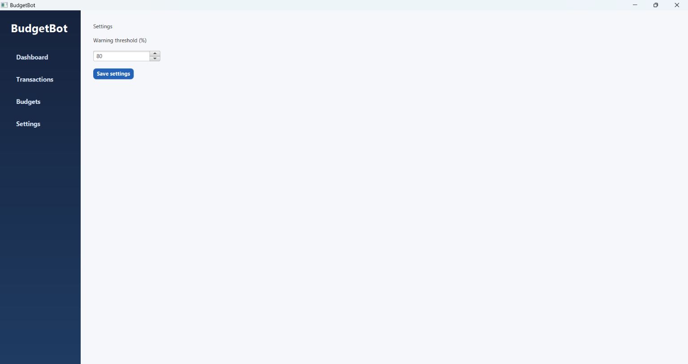

# User Guide

BudgetBot is a local desktop budget tracker for one user. It records dated income and expenses, groups expenses into categories, and compares each category's spending with a fixed monthly budget.



## Getting Started

### Installation

Open the repository's [GitHub Releases](https://github.com/johnwz123/CS3227-2610-MP1/releases) page and download the installer for your corresponding operating system. The packages include the runtime needed by BudgetBot. A packaged installation does not require Java, Gradle, a terminal, an account, or an internet connection after download.

| Operating system    | Package                           | Installation and launch                                                                                                                                          |
|---------------------|-----------------------------------|------------------------------------------------------------------------------------------------------------------------------------------------------------------|
| Windows             | `BudgetBot-<version>-windows.msi` | Open the MSI installer, complete the standard installer, and launch BudgetBot from the Start menu.                                                               |
| macOS               | `BudgetBot-<version>-macos.dmg`   | Open the DMG file, drag BudgetBot to **Applications**, and launch it from Applications.                                                                          |
| Debian/Ubuntu Linux | `BudgetBot-<version>-linux.deb`   | Open the DEB file in the system software installer, or run `sudo apt install ./BudgetBot-<version>-linux.deb`, then launch BudgetBot from the applications menu. |

Download packages only from the repository's [GitHub Releases page](https://github.com/johnwz123/CS3227-2610-MP1/releases). Packages are currently unsigned; Windows and macOS may display a trust warning. Continue only after checking the package source came from this repository's GitHub Release.

### Portable FAT JAR alternative

Alternatively, you can also download `release/BudgetBot.jar` and run BudgetBot from the JAR file without installing BudgetBot. This alternative requires a Java 25 or newer runtime but does not require Gradle. 

From the folder containing the `BudgetBot.jar` file, run:

```shell
java -jar BudgetBot.jar
```

The JAR includes BudgetBot, SQLite JDBC, and the required JavaFX libraries.
Unlike the native MSI, DMG, and DEB packages, it does not include Java itself.

### Data, privacy, and first launch

BudgetBot stores its data in a SQLite file at the following location in the current user's home directory:

```text
Windows:    %USERPROFILE%\.budgetbot\budgetbot.db
macOS/Linux: ~/.budgetbot/budgetbot.db
```

The `~` form means the current user's home directory. The application creates the `.budgetbot` directory and database file when necessary. It initializes the database with:

- nine default expense categories;
- a warning threshold of 80%;

The application is local and single-user. It does not provide login, authentication, cloud synchronization, bank or card integration, automatic import/export, a web API, or operating-system notifications. Data is not sent to a BudgetBot server.

## Main window and navigation

The main window is titled **BudgetBot**. The navigation panel on the left contains four buttons:

1. **Dashboard**
2. **Transactions**
3. **Budgets**
4. **Settings**



The application opens on **Dashboard**. Selecting a navigation button replaces the centre content without opening a browser or a new application window.

### Month navigation

Dashboard, Transactions, and Budgets each contain a month control with:

- a `<` button to move to the previous calendar month;
- a label such as `August 2026`; and
- a `>` button to move to the next calendar month.

The selected month is shared across those three views. Moving to another month reloads the currently selected view.

The initial selected month is the computer's current calendar month.



## Money, dates, and validation rules

These rules apply throughout the application:

- Money is displayed with a dollar sign and two decimal places, for example `$12.50`.
- Money input accepts digits with an optional decimal point and one or two decimal digits, for example `12`, `12.5`, or `12.50`.
- Surrounding whitespace is ignored.
- Currency symbols, commas, negative signs, more than two decimal places, a decimal point without digits after it, and an empty value are not valid monetary input.
- Transaction amounts must be greater than zero.
- Monthly budgets and filter minimum/maximum amounts may be zero but may not be negative.
- Category names must contain non-whitespace text. Stored names are trimmed of whitespace. Category names are unique without regard to letter case.

When the application can reject an input before saving, it displays a validation message. A transaction or budget dialog remains open so the user can correct the input. Persistence failures are shown in an error alert titled **BudgetBot could not save your change**.

## Dashboard

Dashboard is a read-only summary of the selected calendar month.

### Net cash flow

The large summary card is labelled **Net cash flow** and is calculated as:

```text
selected-month net cash flow = selected-month income - selected-month expenses
```

Only transactions whose dates fall inside the selected month are included. A positive value means the month's recorded income is greater than its recorded expenses. A negative value is possible. A month with no transactions displays `$0.00`.

Dashboard net cash flow is independent of any filters entered in the Transactions view. Filtering only changes the transaction list; it does not change calculations.

### Budget status table

The **Budget status** table has these columns:

| Column    | Meaning                                                                              |
|-----------|--------------------------------------------------------------------------------------|
| Category  | Expense category name. Rows are sorted alphabetically without regard to letter case. |
| Available | Fixed base amount available for that category in the selected month.                 |
| Spent     | Sum of all expense transactions in that category and selected month.                 |
| Remaining | `Available - Spent`; it can be negative when the category is over budget.            |

The table does not contain a separate Status column. The Remaining value communicates the state through colour:

- green: `NORMAL`
- orange: `WARNING`
- red: `OVER_BUDGET`

For a positive available amount, a category is in `WARNING` when spending is at or above the configured warning threshold but still below the available amount. It is `OVER_BUDGET` when spending reaches or exceeds the available amount. With a zero budget and no spending, the category remains normal; any positive spending is over budget.



## Transactions

Open **Transactions** to view and manage dated income and expense entries.



### Transaction table

With both date filters empty, the table initially shows transactions from the selected month. Results are ordered newest first by transaction date; entries on the same date are ordered by descending database identifier, so the most recently stored entry appears first for a tie.

The table columns are:

| Column      | Display                                                                                                      |
|-------------|--------------------------------------------------------------------------------------------------------------|
| Date        | A formatted calendar date, such as `5 Aug 2026`.                                                             |
| Type        | `INCOME` or `EXPENSE`.                                                                                       |
| Description | The saved description. If it is blank, the table displays the transaction type instead.                      |
| Category    | The expense category name. Income displays `—`.                                                              |
| Amount      | Income displays `+$amount`; expense displays `-$amount`. Income values are green and expense values are red. |
| Actions     | **Edit** and **Delete** buttons for that row.                                                                |

The table displays **No matching transactions.** when the active query returns no rows. A result count immediately above the table reports `0 transactions`, `1 transaction`, or `<n> transactions`.

### Add a transaction

Select **Add transaction** below the table. The **Add transaction** dialog contains:

| Field | Initial value and rule |
| --- | --- |
| Type | Defaults to `EXPENSE`; the choices are `INCOME` and `EXPENSE`. |
| Amount | Blank and required. It must be a positive number with at most two decimal places. |
| Date | Defaults to today's date. The date is selected with the date picker. |
| Description | Optional text. Surrounding whitespace is removed when saved. |
| Category | Required for an expense. It is disabled when Type is `INCOME`. |

Select **Save** to store the entry or **Cancel** to close the dialog without saving. When an income transaction is saved, its category is ignored and stored as no category. When an expense is saved, the selected category receives the spending.



The dialog validates the amount first. For example, saving with a blank amount displays:

```text
Amount must be a number with at most two decimal places.
```

The dialog stays open. Other possible messages include:

```text
Amount must be greater than zero.
Choose a transaction date.
Choose a category for an expense.
```

Long validation messages wrap across lines and the dialog resizes so the complete message and both **Save** and **Cancel** buttons remain visible.

### Edit a transaction

Select **Edit** in a transaction row. The **Edit transaction** dialog is populated with the existing type, amount, date, description, and category. Change the fields and select **Save**, or select **Cancel** to leave the stored row unchanged.

An edit can change an income into an expense or vice versa. Changing to income removes the category from the stored transaction. Changing to expense requires a category before saving. Changing a date can move the transaction to another month.

After a successful edit, the table is refreshed using the last successfully applied query. Consequently, an edited row disappears if it no longer matches the selected month or active filters, and the result count is updated.



### Delete a transaction

Select **Delete** in a transaction row. BudgetBot asks **Delete transaction?** with **OK** and **Cancel** buttons. Select **OK** to delete the entry or **Cancel** to keep it. Deletion immediately affects the relevant month's net cash flow and category spending, and the table/count are refreshed.

## Search and filter transactions

The Transactions view contains a **Search and filters** panel. Enter criteria and select **Apply filters**. Typing alone does not apply the search query.



### Available controls

| Control            | Behaviour                                                                                                                                              |
|--------------------|--------------------------------------------------------------------------------------------------------------------------------------------------------|
| Search description | Case-insensitive substring search. For example, `market` matches `Market shop`. Blank or whitespace-only input is treated as no description criterion. |
| Start date         | Inclusive earliest date. If entered without an end date, dates from this date onward are considered.                                                   |
| End date           | Inclusive latest date. If entered without a start date, dates up to this date are considered.                                                          |
| Income or expense  | Optional `Income` or `Expense` type criterion.                                                                                                         |
| Expense category   | Optional category criterion. It applies to expenses. Selecting a category automatically sets type to `Expense`.                                        |
| Min amount         | Inclusive minimum amount; zero or greater, with at most two decimals.                                                                                  |
| Max amount         | Inclusive maximum amount; zero or greater, with at most two decimals.                                                                                  |
| Apply filters      | Validates and applies all entered criteria together.                                                                                                   |
| Clear filters      | Clears every criterion and restores all transactions in the selected month.                                                                            |

### Query rules

All active criteria use AND semantics: a transaction must satisfy every populated criterion. Date and amount bounds are inclusive. For example, a transaction dated exactly on the start date or with an amount exactly equal to the minimum is included.

The selected month is the default date range only when both Start date and End date are empty. Supplying either explicit date bound switches to history search:

- Start date only: search from that date forward, without a selected-month upper limit;
- End date only: search up to that date, without a selected-month lower limit; and
- both bounds: search the inclusive range, even when it crosses calendar months.

Selecting `Income` clears the selected expense category and hides that category control. Selecting a category sets the type to `Expense` and keeps the category control visible. Selecting `Expense` by itself does not select a category; it simply matches all expenses unless a category is also chosen.

Filters do not alter transactions, budgets, or dashboard totals. The last successfully applied query remains active while working in the application. It is rerun after a transaction is added, edited, or deleted. Filter criteria are not saved across an application restart.

### Invalid filters and empty results

BudgetBot rejects invalid ranges before replacing the displayed results:

- Start date after End date displays `Start date cannot be after end date.`;
- Min amount greater than Max amount displays `Minimum amount cannot be greater than maximum amount.`; and
- malformed, negative, or over-precise amount input displays a field-specific monetary validation message.

When filter validation fails, the previous table contents and result count remain unchanged. Correct the controls and select **Apply filters** again.

When valid criteria match no row, the table displays **No matching transactions.** and the result count becomes `0 transactions`.

Select **Clear filters** to empty the search text, dates, type, category, minimum, and maximum amount controls. The selected-month transaction list is restored immediately.

## Budgets and categories

Open **Budgets** to manage categories and the selected month's budget amounts. This view uses the same month control as Dashboard and Transactions.



### Budget table and fixed monthly amounts

The Budgets view shows the same Category, Available, Spent, and Remaining columns as Dashboard, plus an Actions column containing **Set budget**, **Rename**, and **Remove**. An **Add** button appears below the table.

Each category has a monthly budget snapshot. Available equals that month's base amount. Spending from another month never changes the selected month's Spent, Available, or Remaining values, and no amount rolls forward from a previous month.

When a month is first opened, BudgetBot creates missing category snapshots. A new snapshot uses the previous month's base amount, or the most recent earlier base amount when available; if no earlier budget exists, it starts at `$0.00`. The current global warning threshold is copied into the snapshot at that time. Once created, the month keeps its own base amount and threshold.

To set a budget, select **Set budget** in a category row. The dialog title is **Set `<category>` budget**, and the field is labelled **Monthly base amount**. Zero is allowed. Select **Save** or **Cancel**. Long validation messages wrap and the dialog keeps its actions visible.

### Default categories

A newly installed application contains these expense categories, shown alphabetically in the tables:

1. Housing & Utilities
2. Groceries
3. Dining
4. Transport
5. Health
6. Entertainment
7. Shopping
8. Education
9. Miscellaneous

Their initial monthly budget amount is zero until a budget is set or a prior monthly base amount is inherited.

### Add a category

Select **Add**. Enter a non-blank name in the **Add category** dialog and select **Save**. Leading and trailing whitespace is removed. Select **Cancel** to discard the new name.

An empty name is rejected with `Category name cannot be empty.`. A duplicate name, including a duplicate differing only in letter case, is rejected and shown as a save error.

### Rename a category

Select **Rename** in the category row. The **Rename category** dialog is prefilled with the current name. Enter a non-blank replacement and select **Save**. Existing expenses continue to refer to the same category and therefore appear under the new name. **Cancel** leaves the name unchanged.

### Remove a category

Select **Remove** in the category row. BudgetBot opens a dialog titled **Remove `<category>`**. Choose another category in **Reassign expenses to:** and select **Reassign and remove**. The replacement list excludes the category being removed. Select **Cancel** to stop.

The replacement choice is required even when the category has no expenses. If no replacement is selected, the dialog displays `Choose a replacement category before removing this one.` and stays open. If the category has expenses, all those expenses are reassigned to the chosen category before the original category is deleted.

BudgetBot always keeps at least one expense category. Attempting to remove the final category is rejected with `BudgetBot must keep at least one expense category.`.

## Settings

Open **Settings** to change the global spending-warning threshold. The view contains:

- a **Warning threshold (%)** spinner;
- values from 1 through 99; and
- a **Save settings** button.

The default is 80. 



Select the spinner arrows to choose a different whole-number percentage, then select **Save settings**. BudgetBot shows:

```text
New settings will apply to the next month started in BudgetBot.
```

The setting is not retroactive. A month is started for this purpose when its monthly budget snapshots are first created while opening Dashboard or Budgets. An already-created month retains the threshold stored in its snapshot; a newly created month copies the current setting.

The setting changes the warning boundary only. It does not change the amount available, the amount spent, or the net cash flow.

## Uninstalling and managing local data

Normal uninstall removes the installed application but preserves `budgetbot.db`:

- Windows: use **Installed apps** or the standard Windows uninstaller
- macOS: remove BudgetBot from **Applications**
- Debian/Ubuntu: run `sudo apt remove budgetbot`

To remove all BudgetBot data deliberately, close the application and delete:

```text
Windows:    %USERPROFILE%\.budgetbot
macOS/Linux: ~/.budgetbot
```

This permanently removes the local budget history. BudgetBot has no in-app backup or restore feature. If a manual backup is needed for coursework testing, close the application first and copy the database file to a safe location; restore only when the application is closed.

## Troubleshooting

### A filter seems to ignore the selected month

An explicit Start date or End date intentionally changes the query from selected-month mode to history mode. Clear both date controls or select **Clear filters** to restore the selected-month default.

### An invalid filter removed the previous result

It should not. The implementation validates reversed date and amount bounds before replacing the table. Confirm that **Apply filters** was used after correcting the message and report the package/source revision if the previous results are lost.

### The warning threshold did not change the current month

Settings are copied when a monthly budget snapshot is first created. An already-created month retains its threshold. Navigate to a month that has not previously been opened to test the new value.

### A trust warning appears for an installer

The initial packages are unsigned and macOS packages are not notarized. Verify that the package came from the repository's GitHub Release before continuing.
